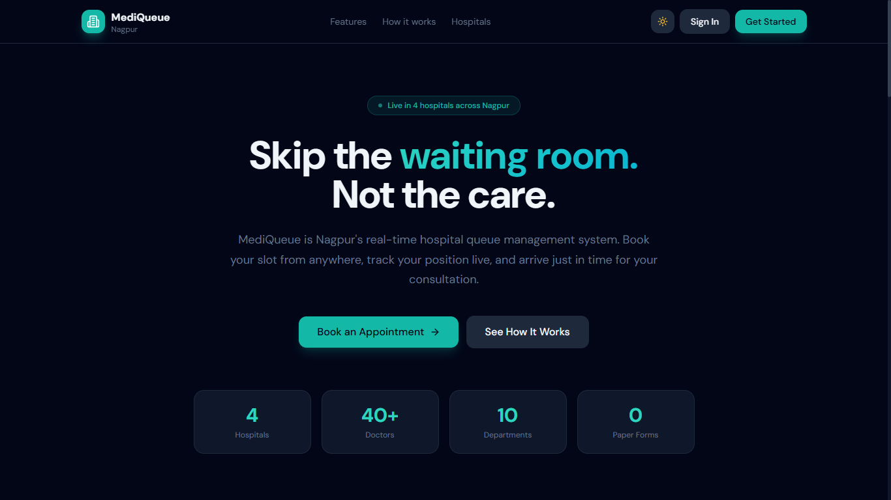
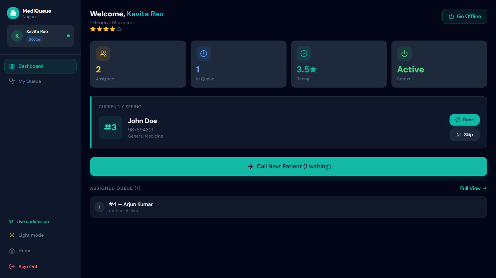

# 🏥 MediQueue — Real-Time Hospital Queue Management System

A production-grade full-stack web application for managing hospital patient queues in real time.

---

## 🚀 Tech Stack

| Layer       | Technology                        |
|-------------|-----------------------------------|
| Frontend    | React 18 + Vite + Tailwind CSS    |
| Backend     | Node.js + Express.js              |
| Database    | MongoDB + Mongoose                |
| Real-Time   | Socket.IO                         |
| Auth        | JWT (Role-Based)                  |
| Charts      | Recharts                          |

---

## 📁 Project Structure

```
hospital-queue/
├── backend/
│   ├── config/db.js              # MongoDB connection
│   ├── controllers/              # Business logic handlers
│   │   ├── authController.js
│   │   ├── appointmentController.js
│   │   ├── queueController.js
│   │   ├── hospitalController.js
│   │   ├── feedbackController.js
│   │   └── analyticsController.js
│   ├── middleware/auth.js         # JWT + role guard middleware
│   ├── models/                   # Mongoose schemas
│   │   ├── User.js               # patient / receptionist / doctor
│   │   ├── Hospital.js
│   │   ├── Appointment.js        # Core queue entity
│   │   └── Feedback.js
│   ├── routes/                   # Express routers
│   ├── services/queueService.js  # Queue brain: tokens, wait times, alerts
│   ├── socket/socketHandler.js   # Socket.IO rooms & event emitters
│   ├── utils/seed.js             # Demo data seeder
│   ├── server.js                 # Entry point
│   └── .env.example
│
└── frontend/
    └── src/
        ├── components/
        │   └── common/           # Layout, UI primitives, LoadingScreen
        ├── context/
        │   ├── AuthContext.jsx   # Auth state + login/logout
        │   └── SocketContext.jsx # Socket.IO connection + room management
        ├── pages/
        │   ├── auth/             # Login, Register
        │   ├── patient/          # Dashboard, Hospitals, Book, Queue, History
        │   ├── receptionist/     # Dashboard, Walk-in, Queue View, Analytics
        │   └── doctor/           # Dashboard, Full Queue Management
        └── services/api.js       # Axios instance + all API helpers
```

---

## 📸 Screenshots

### 🏠 Landing Page


### 📊 Patient Dashboard


### 🚑 Live Queue System


### 📈 Analytics Dashboard



## ⚙️ Setup & Installation

### Prerequisites
- Node.js v18+
- MongoDB (local or Atlas)

### 1. Clone / Extract the project

### 2. Backend Setup

```bash
cd backend
npm install
cp .env.example .env
```

Edit `.env`:
```env
PORT=5000
NODE_ENV=development
MONGO_URI=mongodb://localhost:27017/hospital_queue
JWT_SECRET=your_super_secret_key_change_this
JWT_EXPIRES_IN=7d
CLIENT_URL=http://localhost:5173
AVG_CONSULTATION_TIME_MINUTES=15
NEAR_TURN_ALERT_THRESHOLD=2
```

Seed demo data:
```bash
npm run seed
```

Start the backend:
```bash
npm run dev     # development with nodemon
# or
npm start       # production
```

Backend runs on **http://localhost:5000**

### 3. Frontend Setup

```bash
cd frontend
npm install
npm run dev
```

Frontend runs on **http://localhost:5173**
_(Vite proxies all `/api` and `/socket.io` requests to the backend automatically)_

---

## 🔐 Demo Credentials

| Role         | Email                              | Password      |
|--------------|------------------------------------|---------------|
| Patient      | patient@demo.com                   | Patient@123   |
| Receptionist | receptionist@citygeneral.com       | Recept@123    |
| Doctor       | dr.priya@citygeneral.com           | Doctor@123    |
| Doctor       | dr.rahul@citygeneral.com           | Doctor@123    |

> The login page has **one-click demo fill** buttons — just click a role, then Sign In.

---

## ✨ Features

### Patient
- Register / Login
- Browse hospitals with nearby filtering (Haversine distance)
- Book appointment → get token number
- Live queue tracker with real-time position updates
- Patients-ahead counter + estimated wait time
- Near-turn browser notification (when 2 patients ahead)
- Cancel appointment
- Rate completed appointments (1–5 stars + comment)
- Appointment history with status filtering

### Receptionist
- Walk-in patient registration
- Assign to any doctor in the hospital
- Full hospital queue view with search, doctor filter, status filter
- Emergency priority override
- Cancel any appointment
- Analytics dashboard: today's stats, 7-day trend, doctor performance

### Doctor
- Availability toggle (Online / Offline)
- Full queue dashboard with live updates
- Call next patient (auto-marks previous as Done)
- Mark current patient as Done / Skip
- Emergency priority insertion
- Queue pause / resume
- Rating display

### System
- Socket.IO real-time broadcast on every queue change
- Per-doctor independent queues
- Daily token number generation (no duplicates)
- Priority ordering: Emergency → Token number ASC
- Smart wait time: `patientsAhead × avgConsultationTime`
- Global 401 handler → auto-logout

---

## 📡 API Endpoints

| Method | Endpoint                              | Role             |
|--------|---------------------------------------|------------------|
| POST   | /api/auth/register                    | Public           |
| POST   | /api/auth/login                       | Public           |
| GET    | /api/auth/me                          | All              |
| GET    | /api/hospitals                        | Public           |
| GET    | /api/hospitals/:id                    | Public           |
| POST   | /api/appointments                     | Patient          |
| POST   | /api/appointments/walkin              | Receptionist     |
| GET    | /api/appointments/my                  | Patient          |
| GET    | /api/appointments/hospital/:id        | Recept/Doctor    |
| DELETE | /api/appointments/:id                 | Patient/Recept   |
| GET    | /api/queue/:doctorId                  | All              |
| POST   | /api/queue/:doctorId/next             | Doctor/Recept    |
| PUT    | /api/queue/appointment/:id/status     | Doctor/Recept    |
| PUT    | /api/queue/appointment/:id/emergency  | Doctor/Recept    |
| PUT    | /api/queue/availability               | Doctor           |
| PUT    | /api/queue/:doctorId/pause            | Doctor           |
| GET    | /api/doctors                          | All              |
| POST   | /api/feedback                         | Patient          |
| GET    | /api/feedback/doctor/:id              | Public           |
| GET    | /api/analytics/hospital/:id           | Recept/Doctor    |

---

## 🔌 Socket.IO Events

| Event                       | Direction        | Description                       |
|-----------------------------|------------------|-----------------------------------|
| `queue_updated`             | Server → Client  | Any queue change for a doctor      |
| `new_appointment`           | Server → Client  | New booking at hospital            |
| `emergency_alert`           | Server → Client  | Emergency patient inserted         |
| `near_turn_alert`           | Server → Patient | 2 patients ahead notification      |
| `doctor_availability_changed`| Server → Client | Doctor goes on/offline             |
| `queue_paused`              | Server → Client  | Queue paused/resumed               |
| `join_queue_room`           | Client → Server  | Subscribe to a doctor's queue      |
| `leave_queue_room`          | Client → Server  | Unsubscribe from queue             |

---

## 🚢 Production Deployment

### Railway (Recommended — One Click)
1. Push code to GitHub
2. Create Railway project → Add MongoDB service
3. Add backend as Node.js service with env vars
4. Set `MONGO_URI` to Railway's MongoDB URL
5. Deploy frontend to Vercel; set `VITE_API_URL` to Railway backend URL

### Environment Changes for Production
```env
NODE_ENV=production
MONGO_URI=<atlas-or-railway-uri>
JWT_SECRET=<cryptographically-strong-random-64-char-string>
CLIENT_URL=https://your-frontend.vercel.app
```

---

## ⚡ Scaling Recommendations

1. **Redis adapter for Socket.IO** — required when running multiple backend instances
2. **MongoDB Atlas** with read replicas for analytics queries
3. **Queue jobs with Bull/BullMQ** — for notification delivery reliability
4. **Nginx** as reverse proxy with WebSocket upgrade support
5. **Docker Compose** for local multi-service development
6. **Rate limiting per user** (not just IP) for appointment booking

## 🚧 Potential Bottlenecks

- `recalculateWaitTimes` runs on every status change — consider debouncing for large queues
- Analytics aggregations should be cached (Redis, 1-min TTL) for high-traffic hospitals
- Socket.IO in-memory rooms won't survive pod restarts — use Redis adapter in production


👩‍💻Author:
Khushi Shambharkar